# Meta Ray-Ban Display Glasses demos by L+R

A collection of demo web apps for the [Meta Ray-Ban Display glasses](https://wearables.developer.meta.com/docs).

Each app is a small, self-contained web project designed for the 600x600 display and D-pad navigation. Built by [L+R](https://levinriegner.com) to explore what's possible on the glasses.

## Hosted demos

### Primary demos
> UI polished, fully functional.

| Demo | Source | Live | Case study | Preview |
|---|---|---|---|---|
| **Brush Coach** — toothbrush stroke counter that tracks brushing motion and guides you through mouth zones | [code](https://github.com/levin-riegner/lr-rbm-demos/tree/main/brusher) | [open](https://rbm-demos.lnr.io/brusher/) | [read](https://www.levinriegner.com/work/brush-coach/) |  |
| **Calculator** — four-function calculator with multiple themes and D-pad input | [code](https://github.com/levin-riegner/lr-rbm-demos/tree/main/calculator) | [open](https://rbm-demos.lnr.io/calculator/) | — |  |
| **Cooking HUD** — step-by-step recipe flow with a multi-timer rail and shop/prep/cook phases | [code](https://github.com/levin-riegner/lr-rbm-demos/tree/main/cooking-hud) | [open](https://rbm-demos.lnr.io/cooking-hud/) | [read](https://www.levinriegner.com/work/cooking-hud/) | 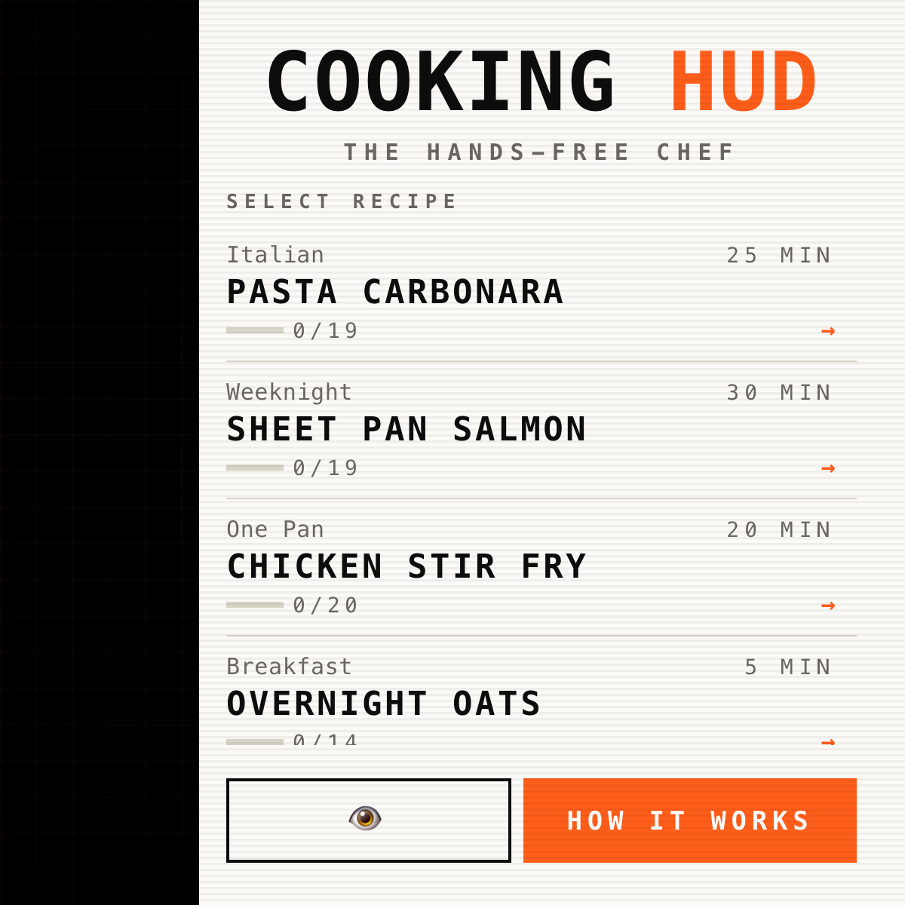 |
| **Dad Jokes** — random dad jokes with auto-fitting type and rim-shot audio stings | [code](https://github.com/levin-riegner/lr-rbm-demos/tree/main/dad-jokes) | [open](https://rbm-demos.lnr.io/dad-jokes/) | — |  |
| **Flight Status** — airline and flight lookup with terminal, gate, and boarding details | [code](https://github.com/levin-riegner/lr-rbm-demos/tree/main/flight-status) | [open](https://rbm-demos.lnr.io/flight-status/) | [read](https://www.levinriegner.com/work/flight-status/) |  |
| **GLIMMER** — Tamagotchi-style companion with five evolution stages, stat decay, and events | [code](https://github.com/levin-riegner/lr-rbm-demos/tree/main/lr-glimmer) | [open](https://rbm-demos.lnr.io/lr-glimmer/) | [read](https://www.levinriegner.com/work/glimmer/) |  |
| **Metronome** — hands-free metronome with tempo, time signature, and head-nod beat input | [code](https://github.com/levin-riegner/lr-rbm-demos/tree/main/metronome) | [open](https://rbm-demos.lnr.io/metronome/) | [read](https://www.levinriegner.com/work/metronome/) |  |
| **Pentatonic Solo** — pentatonic synth locked to B minor with an animated oscilloscope | [code](https://github.com/levin-riegner/lr-rbm-demos/tree/main/pentatonic-solo) | [open](https://rbm-demos.lnr.io/pentatonic-solo/) | — | 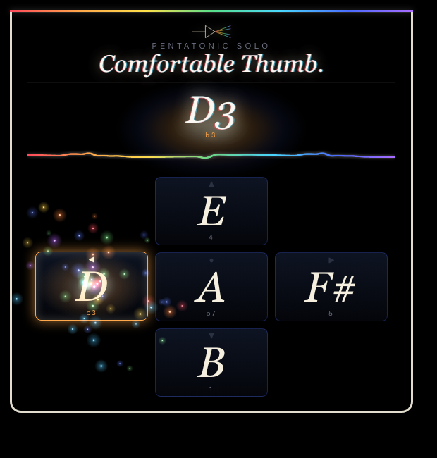 |
| **Periff** — voice recorder for ideas with transcription and a searchable archive of riffs | [code](https://github.com/levin-riegner/lr-rbm-demos/tree/main/periff) | [open](https://rbm-demos.lnr.io/periff/) | — | 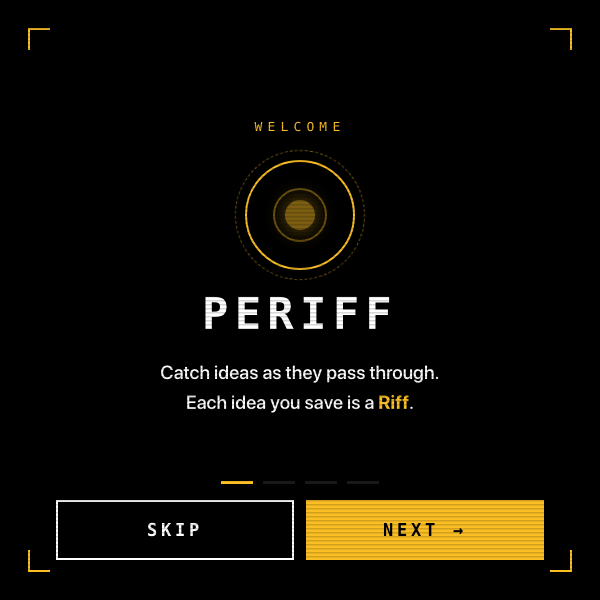 |
| **Pinout HUD** — ESP32 pinout reference with board templates and a zoomable focus mode | [code](https://github.com/levin-riegner/lr-rbm-demos/tree/main/pinout-hud) | [open](https://rbm-demos.lnr.io/pinout-hud/) | [read](https://www.levinriegner.com/work/pinout-hud/) | 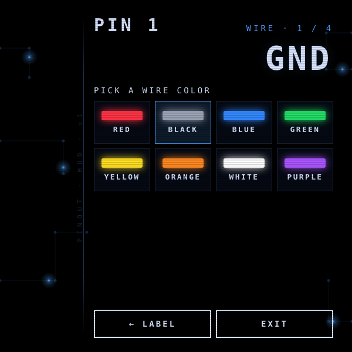 |
| **Pong** — two-player Pong over WebSocket with room codes and server-authoritative physics | [code](https://github.com/levin-riegner/lr-rbm-demos/tree/main/pong) | [open](https://rbm-demos.lnr.io/pong/) | — | 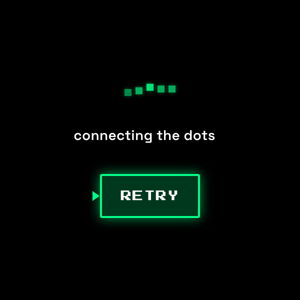 |
| **Tally Counter** — single-button tally counter with running total and "since" timestamp | [code](https://github.com/levin-riegner/lr-rbm-demos/tree/main/tally-counter) | [open](https://rbm-demos.lnr.io/tally-counter/) | [read](https://www.levinriegner.com/work/tally-counter/) | 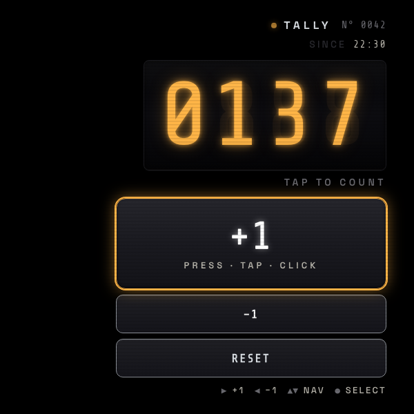 |
| **Zork Terminal** — CRT-styled text adventure with D-pad verb picker and typewriter output | [code](https://github.com/levin-riegner/lr-rbm-demos/tree/main/zork-terminal) | [open](https://rbm-demos.lnr.io/zork-terminal/) | [read](https://www.levinriegner.com/work/zork-i-tribute/) |  |

### Secondary demos — Works in progress!

| Demo | Source | Live | Case study | Preview |
|---|---|---|---|---|
| **See DJ** — passive booth HUD that reads Pro DJ Link to show per-deck track, BPM, beat, pitch, MASTER/SYNC tags, 4-channel mixer and crossfader telemetry | [code](https://github.com/levin-riegner/lr-rbm-demos/tree/main/see-dj) | [open](https://rbm-demos.lnr.io/see-dj/) | [read](https://www.levinriegner.com/work/see-dj/) |  |
| **Chores** — daily chore checklist with one-tap supply reorders via Amazon deep links | [code](https://github.com/levin-riegner/lr-rbm-demos/tree/main/chores) | [open](https://rbm-demos.lnr.io/chores/) | — | 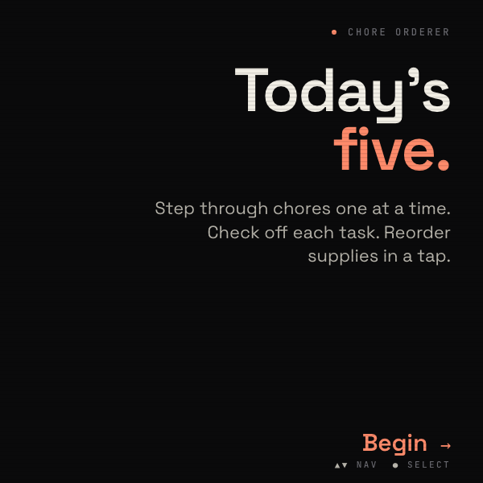 |
| **Crypto Tracker** — live crypto prices, 24h change, and favorites pulled from CoinGecko | [code](https://github.com/levin-riegner/lr-rbm-demos/tree/main/crypto-tracker) | [open](https://rbm-demos.lnr.io/crypto-tracker/) | — |  |
| **Flashcards (Serbian)** — Serbian vocabulary trainer with separate Learn and Test modes | [code](https://github.com/levin-riegner/lr-rbm-demos/tree/main/flashcards-serbian) | [open](https://rbm-demos.lnr.io/flashcards-serbian/) | — | 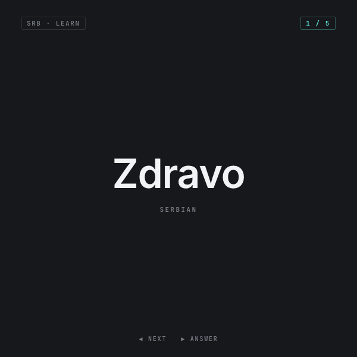 |
| **Kairos Calendar HUD** — ambient calendar with today/next/free/tomorrow zones and a quick agenda view | [code](https://github.com/levin-riegner/lr-rbm-demos/tree/main/kairos-calendar-hud) | [open](https://rbm-demos.lnr.io/kairos-calendar-hud/) | — | 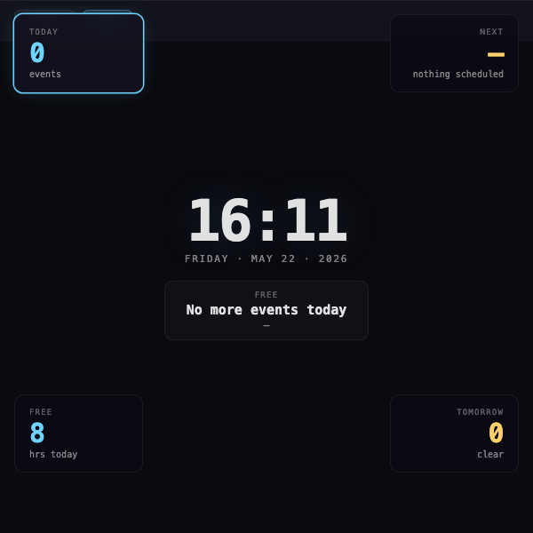 |
| **Knot Helpful** — step-by-step tutor for six famous knots (bowline, figure-8, clove, monkey's fist, trucker's, constrictor) with diagrams + per-step mistake tips | [code](https://github.com/levin-riegner/lr-rbm-demos/tree/main/knot-help) | [open](https://rbm-demos.lnr.io/knot-help/) | — |  |
| **Meditation** — box-breathing timer with animated guide, session history, and completion bell | [code](https://github.com/levin-riegner/lr-rbm-demos/tree/main/meditation) | [open](https://rbm-demos.lnr.io/meditation/) | — | 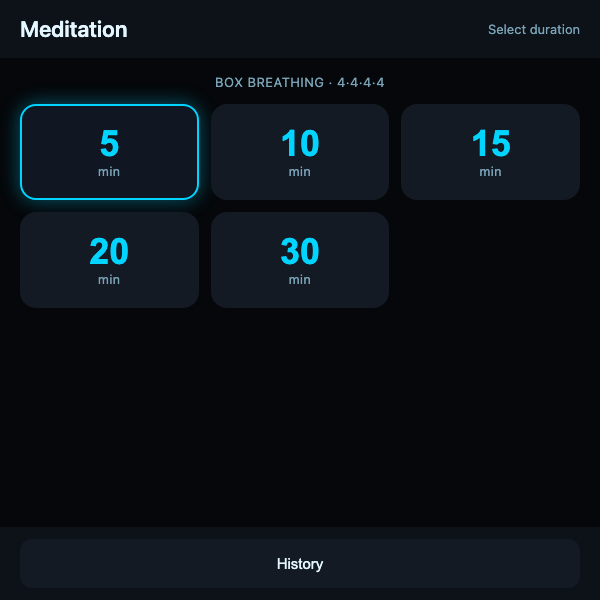 |
| **Origami Sensei** — step-by-step paper-folding instructor across six origami models | [code](https://github.com/levin-riegner/lr-rbm-demos/tree/main/origami-sensei) | [open](https://rbm-demos.lnr.io/origami-sensei/) | — | 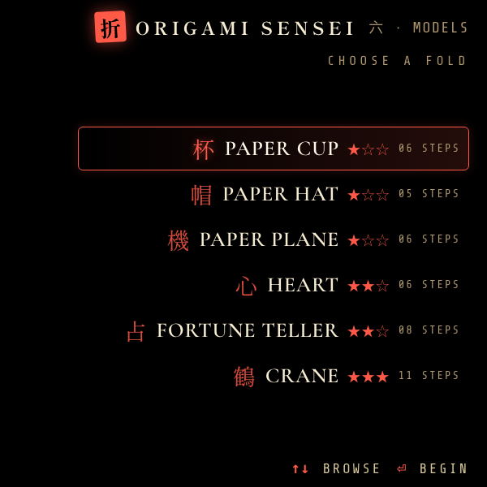 |
| **Plane Spotter** — tracks the nearest aircraft with a head-tracked arrow via the OpenSky API | [code](https://github.com/levin-riegner/lr-rbm-demos/tree/main/plane-spotter) | [open](https://rbm-demos.lnr.io/plane-spotter/) | — | 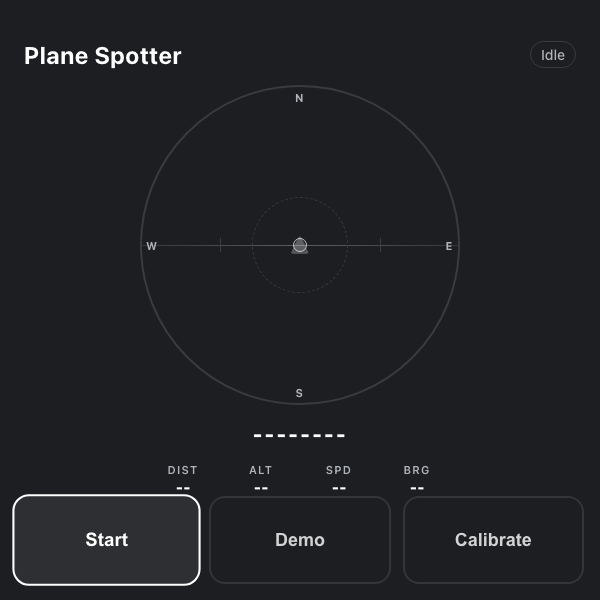 |
| **Pomodoro** — 25/5/15 minute Pomodoro timer with cycle stats persisted locally | [code](https://github.com/levin-riegner/lr-rbm-demos/tree/main/pomodoro) | [open](https://rbm-demos.lnr.io/pomodoro/) | — |  |
| **Presto** — sleight-of-hand magic coach with tricks, patter, and pinch-triggered cues | [code](https://github.com/levin-riegner/lr-rbm-demos/tree/main/presto) | [open](https://rbm-demos.lnr.io/presto/) | — | 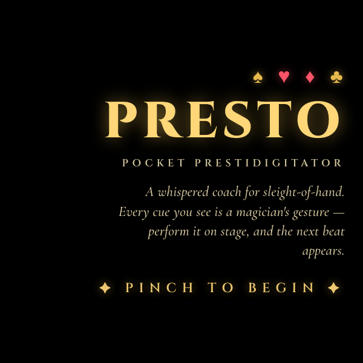 |
| **Recipe Stepper** — paginates any recipe into D-pad-friendly steps using AI extraction | [code](https://github.com/levin-riegner/lr-rbm-demos/tree/main/recipe-stepper) | [open](https://rbm-demos.lnr.io/recipe-stepper/) | — | 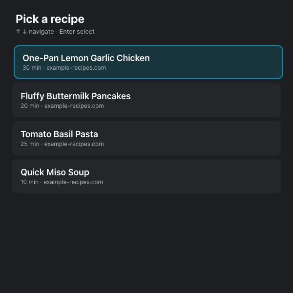 |
| **Snake** — classic Snake game with D-pad control and local high scores | [code](https://github.com/levin-riegner/lr-rbm-demos/tree/main/snake) | [open](https://rbm-demos.lnr.io/snake/) | — | 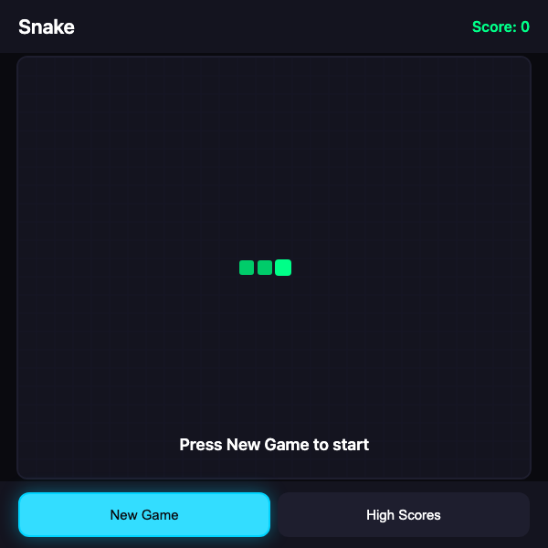 |
| **Trivia Live** — 10-question live trivia from the Open Trivia DB with category and difficulty pickers | [code](https://github.com/levin-riegner/lr-rbm-demos/tree/main/trivia-live) | [open](https://rbm-demos.lnr.io/trivia-live/) | — | 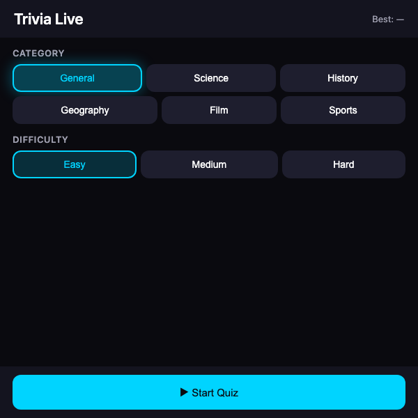 |
| **Twitch Chat HUD** — large-type Twitch chat feed streamed anonymously over IRC WebSocket for hands-free streamers | [code](https://github.com/levin-riegner/lr-rbm-demos/tree/main/twitch-chat) | [open](https://rbm-demos.lnr.io/twitch-chat/) | — |  |
| **Weather Dashboard** — 5-day forecast for preset cities via Open-Meteo with a 10-minute cache | [code](https://github.com/levin-riegner/lr-rbm-demos/tree/main/weather-dashboard) | [open](https://rbm-demos.lnr.io/weather-dashboard/) | — |  |

### Proof of concept demos

| Demo | Source | Live | Case study | Preview |
|---|---|---|---|---|
| **Deep Link Launcher** — source app that hands off to another demo via query-param deep links | [code](https://github.com/levin-riegner/lr-rbm-demos/tree/main/deep-link-launcher) | [open](https://rbm-demos.lnr.io/deep-link-launcher/) | — | 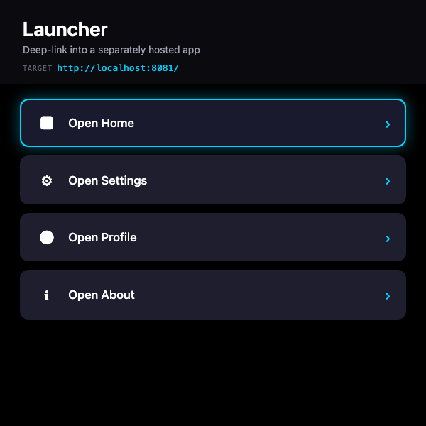 |
| **Deep Link Target** — receiver app that opens to a specific screen and shows the referrer | [code](https://github.com/levin-riegner/lr-rbm-demos/tree/main/deep-link-target) | [open](https://rbm-demos.lnr.io/deep-link-target/) | — | 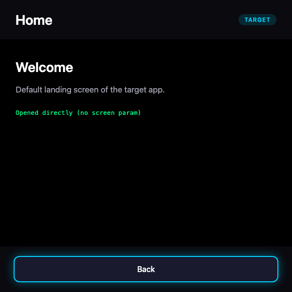 |
| **Find My Car** — saves your parking spot and walks you back with compass bearing and distance | [code](https://github.com/levin-riegner/lr-rbm-demos/tree/main/find-my-car) | [open](https://rbm-demos.lnr.io/find-my-car/) | — | 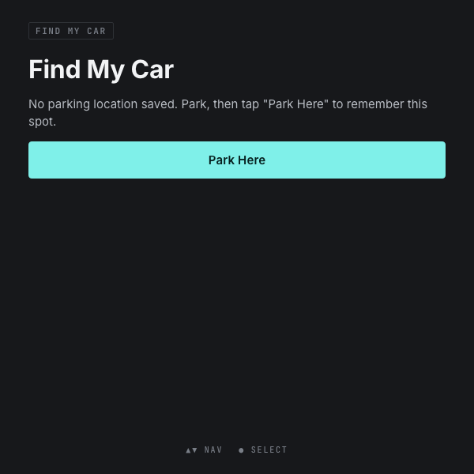 |
| **Head Gesture Prototype** — dismiss a notification with a head shake using DeviceOrientation events | [code](https://github.com/levin-riegner/lr-rbm-demos/tree/main/head-gesture-prototype) | [open](https://rbm-demos.lnr.io/head-gesture-prototype/) | — | 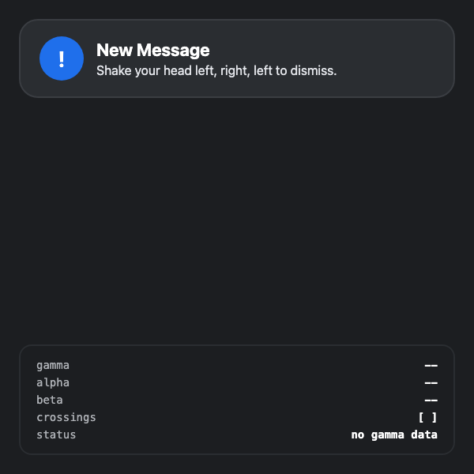 |
| **Headprint** — biometric wearer ID built from a four-gesture head-motion profile | [code](https://github.com/levin-riegner/lr-rbm-demos/tree/main/headprint) | [open](https://rbm-demos.lnr.io/headprint/) | — | 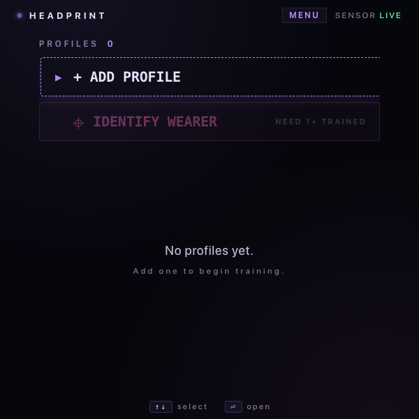 |
| **Levin Riegner** — L+R studio portfolio HUD with work, services, about, and contact sections | [code](https://github.com/levin-riegner/lr-rbm-demos/tree/main/levinriegner) | [open](https://rbm-demos.lnr.io/levinriegner/) | — | 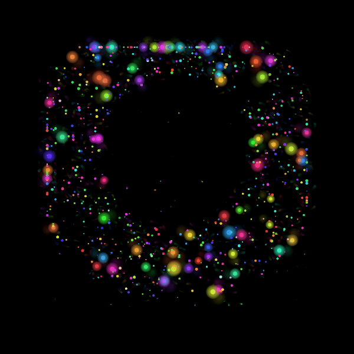 |
| **Speedometer** — live GPS speed readout with top-speed tracking and a level indicator | [code](https://github.com/levin-riegner/lr-rbm-demos/tree/main/speedometer) | [open](https://rbm-demos.lnr.io/speedometer/) | — | 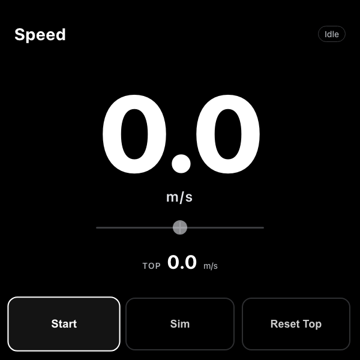 |
| **Stub** — receipt and ticket capture with OCR; nothing is saved to the camera roll | [code](https://github.com/levin-riegner/lr-rbm-demos/tree/main/stub) | [open](https://rbm-demos.lnr.io/stub/) | — | 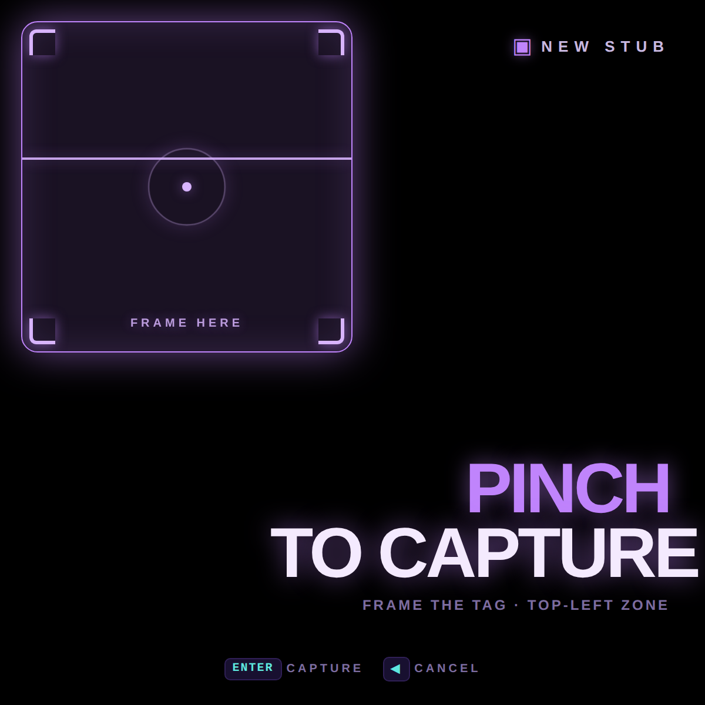 |
| **Teleprompter (admin)** — phone-side dashboard that pushes live script lines to the glasses via Socket.io | [code](https://github.com/levin-riegner/lr-rbm-demos/tree/main/teleprompter/admin) | [open](https://rbm-demos.lnr.io/teleprompter/admin/) | — | 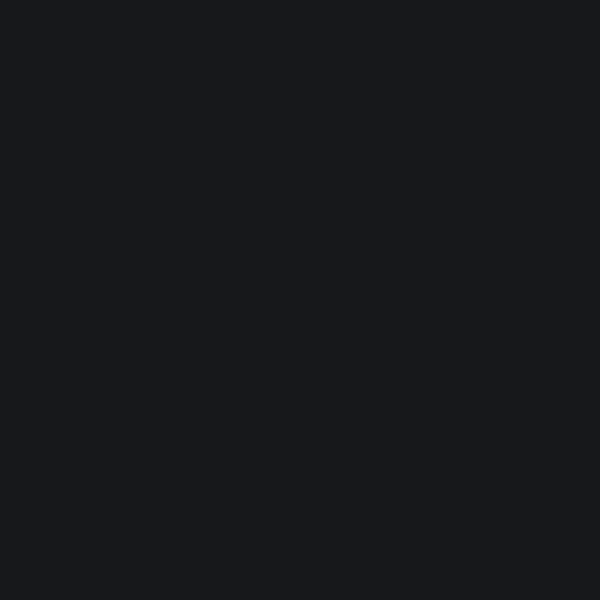 |
| **Teleprompter (glasses)** — glasses-side reader that displays lines pushed from the admin in real time | [code](https://github.com/levin-riegner/lr-rbm-demos/tree/main/teleprompter/glasses) | [open](https://rbm-demos.lnr.io/teleprompter/glasses/) | — |  |
| **Tiltscroll Tales** — head-tilt-scrolled fairy tale across four chapters with glowing visuals | [code](https://github.com/levin-riegner/lr-rbm-demos/tree/main/tiltscroll-tales) | [open](https://rbm-demos.lnr.io/tiltscroll-tales/) | — | 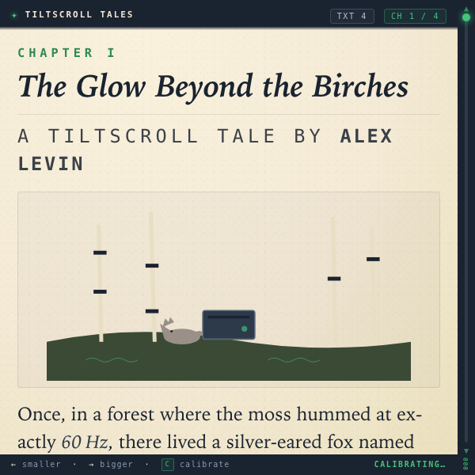 |

### Testing apps

| Demo | Source | Live | Case study | Preview |
|---|---|---|---|---|
| **Glasses API Test** — D-pad smoke test for platform APIs (vibration, WebGL, NFC, battery, and more) | [code](https://github.com/levin-riegner/lr-rbm-demos/tree/main/glasses-api-test) | [open](https://rbm-demos.lnr.io/glasses-api-test/) | — | 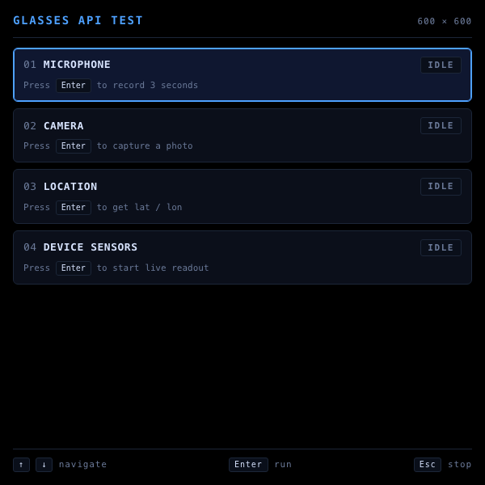 |
| **Glasses Wack** — broader API checker covering graphics, storage, network, and sensors | [code](https://github.com/levin-riegner/lr-rbm-demos/tree/main/glasses-wack) | [open](https://rbm-demos.lnr.io/glasses-wack/) | — | 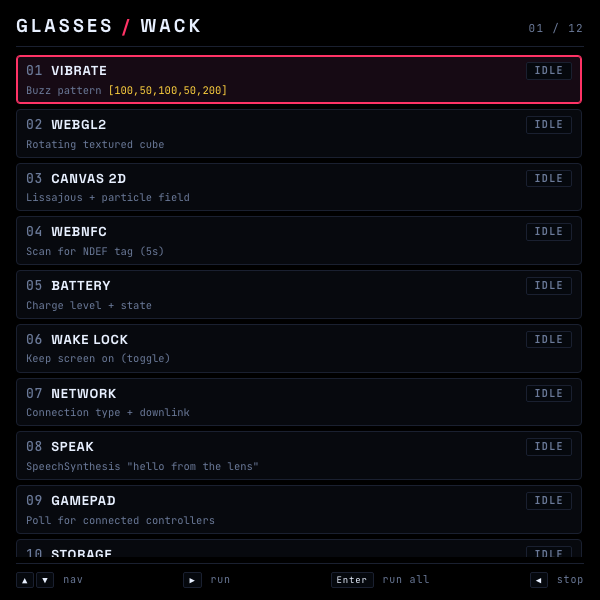 |
| **IP Info** — shows your public IP, city, timezone, and ISP via ipapi.co | [code](https://github.com/levin-riegner/lr-rbm-demos/tree/main/ip-info) | [open](https://rbm-demos.lnr.io/ip-info/) | — | 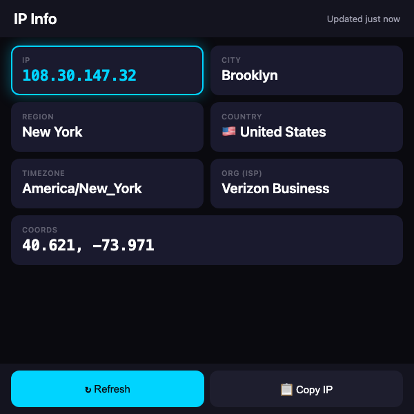 |
| **Key Logger** — visualizes D-pad taps, double-taps, and holds with ripples, particles, and sound | [code](https://github.com/levin-riegner/lr-rbm-demos/tree/main/key-logger) | [open](https://rbm-demos.lnr.io/key-logger/) | — | 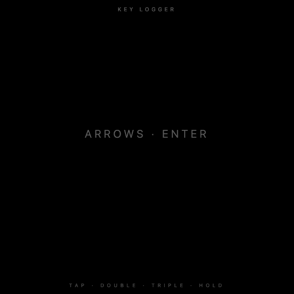 |
| **Pair HUD** — WebSocket PIN pairing to push content from your phone to the HUD | [code](https://github.com/levin-riegner/lr-rbm-demos/tree/main/pair-hud) | [open](https://rbm-demos.lnr.io/pair-hud/) | — |  |

## Simulator

A browser-based simulator that previews how any web app would look on the display glasses. It applies the additive waveguide blend (plus-lighter) over a real-world background image, so you can judge contrast and legibility without a physical device.

Try it live: [https://displayglasses.dev](https://displayglasses.dev)

Features:
- Load any URL into the simulated 600x600 HUD
- Drag to reposition, resize the display
- Swap background scenes or upload your own image/video
- Adjust HUD brightness, size, and background brightness
- Press **H** to hide all UI overlays for clean screen recordings

## Running an app locally

```bash
cd <app-name>
python3 -m http.server 8080
```

Open `http://localhost:8080` in Chrome, set the viewport to 600x600 via DevTools, and navigate with arrow keys.

## License

MIT — see [LICENSE](LICENSE).
