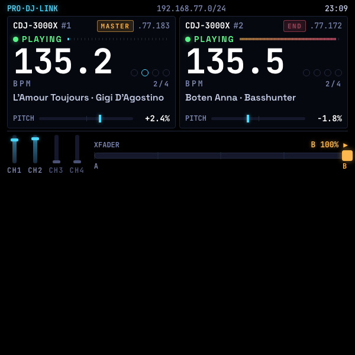

# CDJ Display

A glanceable booth telemetry HUD for DJs running two **CDJ-3000Xs** on a Pro DJ Link network. The display fills only the **top half** of the lens — 600 × 300 px — so it floats above the mixer without ever covering the dancefloor or the gear.

> 📖 **Case study:** [levinriegner.com/work/see-dj](https://www.levinriegner.com/work/see-dj/)
> 🌐 **Live demo:** [rbm-demos.lnr.io/cdj-display](https://rbm-demos.lnr.io/cdj-display/)

---

## What it does

- **Two-deck overview at a glance.** For each CDJ-3000X the HUD shows unit number, IP on the Pro DJ Link subnet, PLAYING / CUE / PAUSED status, live BPM, a downbeat-aware 4-step beat indicator (1/4 · 2/4 · 3/4 · 4/4), the current track, and pitch-fader position with sign and percentage.
- **MASTER / SYNC tags.** Knows which deck is currently driving the tempo and which is following — and which has nothing routed at all.
- **END alert.** Any deck whose track is past 90 % gets a **blinking red `END`** badge and a red play-progress bar — a passive nudge to start the next mix before the floor goes silent.
- **Live mixer state.** Four channel faders rendered as vertical strips — CH1 is wired to Deck A, CH2 to Deck B, CH3 / CH4 stay dim when nothing is routed there. You can see at a glance which channels are *up* and which are *down*.
- **Crossfader telemetry.** A wide ribbon shows the crossfader's exact position with five tick marks; the indicator turns amber and labels `◀ A 85%` or `B 85% ▶` the moment it leaves center, so the DJ always knows which deck the room is hearing.
- **Half-lens layout.** The bottom 300 px of the lens stays pure `#000`, which reads as transparent on the additive waveguide — so the dancefloor stays visible below the HUD.

### Scripted demo scene

The default boot scene is a full mix-out, scripted from the kind of Pro DJ Link telemetry the HUD would receive in production:

1. **0 s** — Deck B is live to the floor with *Boten Anna · Basshunter* (138 BPM, near the end of the track — `END` is already blinking). Crossfader is pinned hard to B; CH2 is up. Deck A has just been cued with *L'Amour Toujours · Gigi D'Agostino* (132 BPM, MASTER).
2. **0 → 15 s** — Deck A's pitch ramps from 132 → 138 BPM (≈ +4.55 %), beat-matching to B.
3. **18 → 22 s** — A one-shot platter nudge slides Deck A's beat 1 onto Deck B's beat 1 so the downbeats lock.
4. **23.5 → 28.5 s** — The crossfader cosine-eases from full B over to full A — the DJ swapping the live track.
5. **28.5 s →** — Deck A is now playing out to the room; the floor never hears silence.

In a production build the same view could be driven straight from Pioneer's Pro DJ Link UDP packets or [`prolink-connect`](https://github.com/EvanPurkhiser/prolink-connect) and become a real booth display.

---

## Controls

**None.** This is a passive read-only HUD — the DJ drives the gear, the glasses just report what the CDJs and mixer are doing. No D-pad input, no swipes, no Enter binding.

---

## Screenshots

| Boot — Deck B live (END blinking), Deck A cued + pitch ramping | Crossfader pushed toward Deck A | Crossfader pushed toward Deck B |
| --- | --- | --- |
|  |  |  |

| Deck B cued (channel dropped) | Pitched (Deck A +2.4 %, Deck B −1.8 %) |
| --- | --- |
|  |  |

---

## Running locally

The app is a single static HTML/CSS/JS bundle — no build step.

```bash
npx serve -l 4220 cdj-display
# then open http://localhost:4220
```

### Regenerating screenshots

> 🛠️ **Developer tooling only.** The app itself has zero Chrome dependency — it's vanilla HTML/CSS/JS that runs in the Ray-Ban Meta Display's built-in browser. The block below is just the local recipe used on a Mac to refresh the PNGs in `screenshots/`.

The screenshots above are produced from headless Chrome against the `?state=…` URL parameter the app reads on load:

```bash
npx serve -l 4220 cdj-display &
CHROME="/Applications/Google Chrome.app/Contents/MacOS/Google Chrome"
for STATE in home crossfade-a crossfade-b cue pitched; do
  "$CHROME" --headless=new --disable-gpu --hide-scrollbars \
    --window-size=600,600 --virtual-time-budget=3000 \
    --screenshot="cdj-display/screenshots/$STATE.png" \
    "http://localhost:4220/?state=$STATE"
done
```

---

## Files

```
cdj-display/
├── index.html      # top-half HUD: 2 decks + 4-ch mixer + crossfader
├── styles.css      # 600×300 black booth telemetry; cyan + jade + amber + red
├── app.js          # scripted timeline, beat clock, pitch ramp, END alert, ?state= routing
├── favicon.svg     # cyan jog-wheel mark
└── screenshots/    # generated state captures used by this README
```

<sub>Made by Alex Levin at [L+R](https://www.levinriegner.com).</sub>
