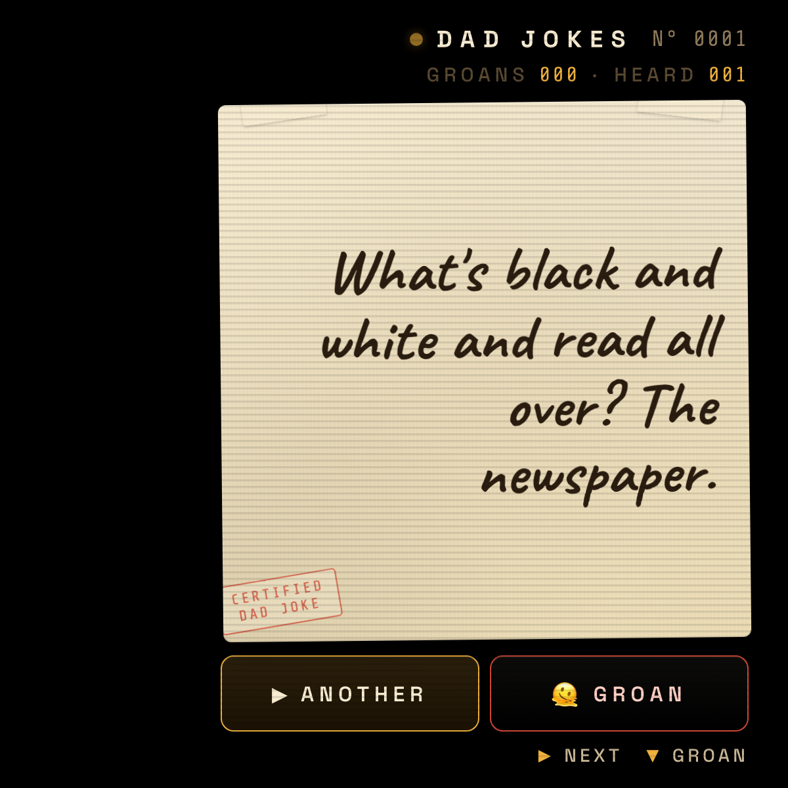
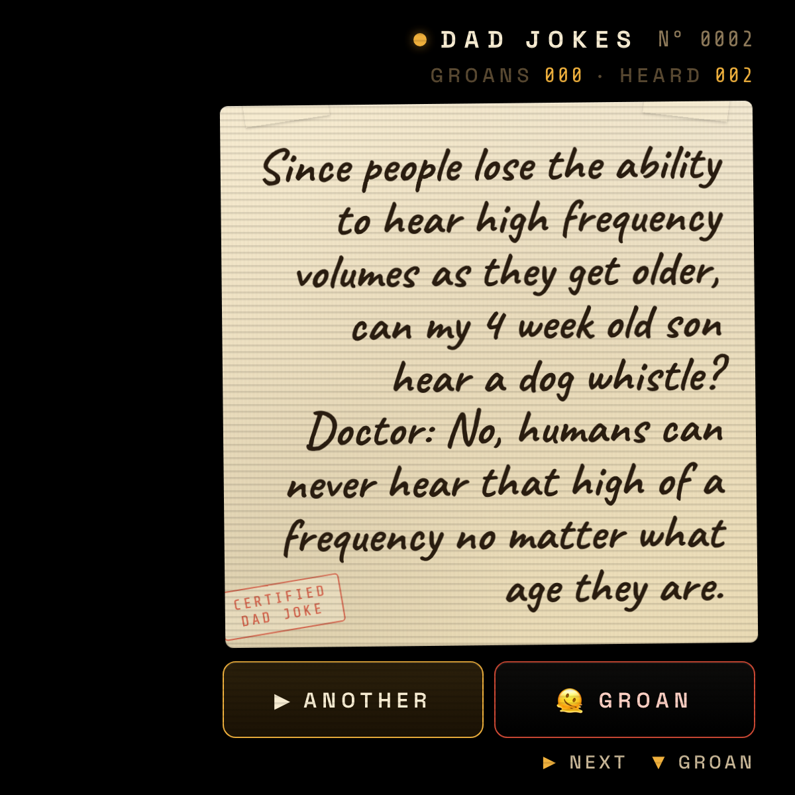

# Dad Jokes

A wearable HUD for the Ray-Ban Meta Display Glasses that fetches a random dad joke from [icanhazdadjoke.com](https://icanhazdadjoke.com/) and serves it on a cream paper card.



One joke at a time. Press ▶ for the next one, ▼ when you need to groan.

## Auto-fitting type

The joke text uses [Caveat](https://fonts.google.com/specimen/Caveat) handwriting and auto-shrinks to fit the card — short zingers get the full 48px treatment, longer setups quietly step down until everything's on the page.

| Short | Long |
|---|---|
|  |  |

## Controls

| Key | Action |
|---|---|
| `Enter` / `Space` / `→` / `←` / `↑` | Next joke |
| `↓` / `G` | Groan (sad trombone + screen shake) |
| Tap the card | Next joke |

Designed for the right-lens HUD, so the whole panel is right-aligned (left padding 168px) and content lives in the right half of the 600×600 viewport.

## Sounds

All synthesized live via Web Audio:

- **Rim shot** (`ba-dum-tss`) on every new joke — two sine kicks plus a highpass-filtered noise crash
- **Sad trombone** on `GROAN` — three descending sawtooth voices through a lowpass
- Audio unlocks on first interaction (browser autoplay policies)

## Counters

`HEARD` and `GROANS` persist across sessions in `localStorage` under the key `mdg_dad_jokes_v1`.

## Run it

```bash
npx serve -l 4213 dad-jokes
# open http://localhost:4213
```

Or use the workspace `dad-jokes` launch config (port 4213) in `.claude/launch.json`.

## Stack

Pure HTML / CSS / JS. No build step, no dependencies. Fetches against the public icanhazdadjoke.com JSON API. Three files: `index.html`, `styles.css`, `app.js`.

---

<sub>By Alex Levin · [L+R](https://levinriegner.com)</sub>
