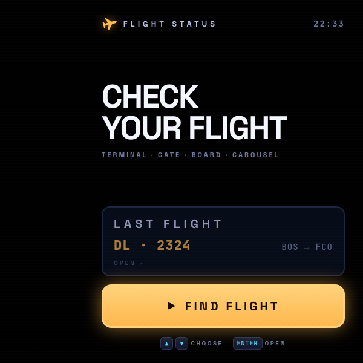
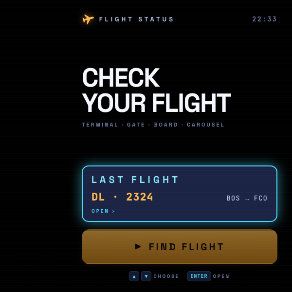
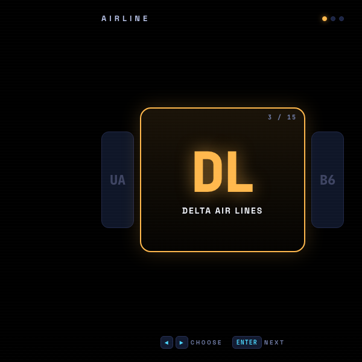
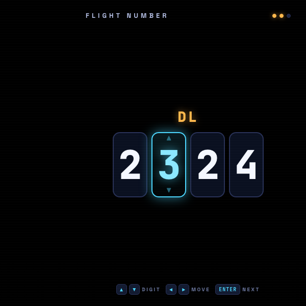
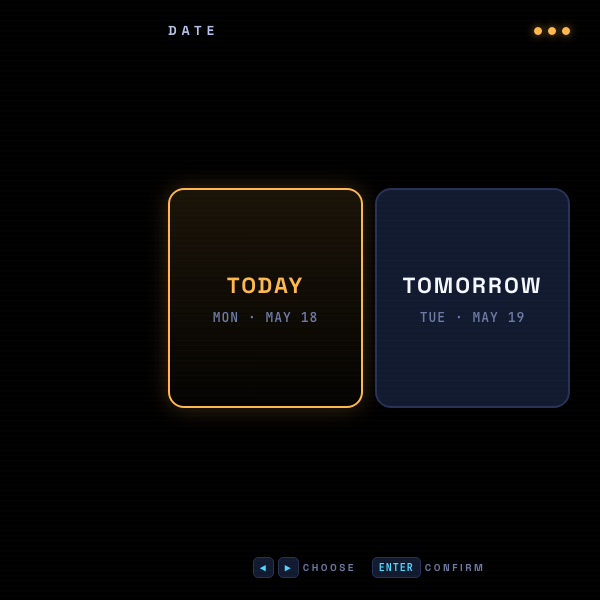
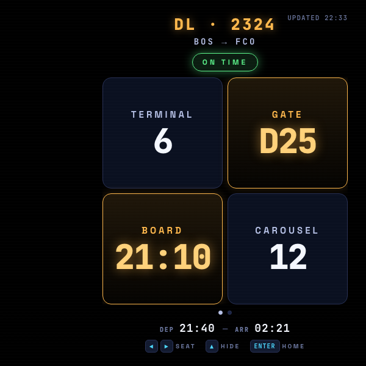
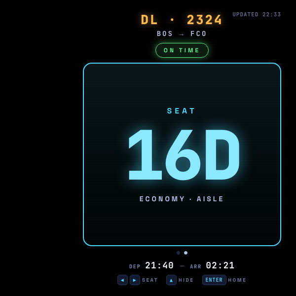
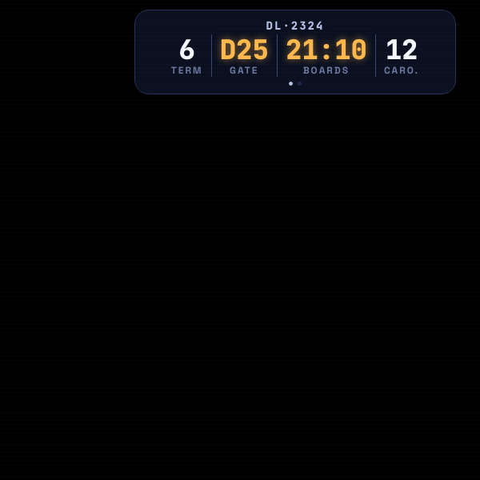
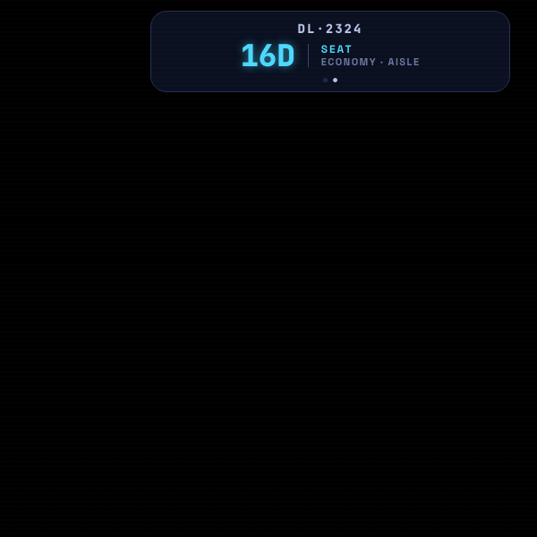

# Flight Status

A heads-up display for Meta Display glasses that surfaces the four things you actually need at the airport — **terminal, gate, boarding time, carousel** — plus your seat. Pick a flight without typing a single character, and keep the information glanceable while you walk.

> 📖 **Case study:** [levinriegner.com/work/flight-status](https://www.levinriegner.com/work/flight-status/)

---

## What it does

- **Type-free flight lookup.** Pick airline from a carousel of 15 carriers (AA, UA, DL, B6, …), set a 4-digit flight number with a wheel picker, pick today or tomorrow — all with ◀ ▶ ▲ ▼ and Enter.
- **Persistent status display.** A 2×2 grid of large tiles — TERMINAL · GATE · BOARD · CAROUSEL — with gate + boarding time emphasized in amber. Status badge (ON TIME / DELAYED / BOARDING) and DEP/ARR times underneath.
- **Seat view.** Swipe horizontally to flip to a big cyan seat code with class + window/aisle role.
- **Compact mode.** Swipe up to collapse into a single pinned strip at the top of the lens — same four metrics, divided into columns with labels, so the HUD stays out of your way. Swipe down to expand again. Compact mode has its own seat sub-view too.
- **Last-flight memory.** The home screen remembers the most recent flight you checked; press ▲ + Enter to re-open it instantly with no wizard.

All mock data is deterministic — the same airline + flight + date hash always renders the same terminal / gate / board / carousel / seat / status, so the demo behaves predictably.

---

## Controls

| Where | Input | Result |
| --- | --- | --- |
| Home | ▲ | Focus LAST FLIGHT card |
| Home | ▼ | Focus FIND FLIGHT button |
| Home | Enter | Open focused option |
| Airline picker | ◀ ▶ | Cycle through carriers |
| Airline picker | Enter | Next step |
| Flight number | ▲ ▼ | Change selected digit (0–9, wraps) |
| Flight number | ◀ ▶ | Move between digits |
| Flight number | Enter | Next step |
| Date | ◀ ▶ | Today / Tomorrow |
| Date | Enter | Show status |
| Status (full) | ◀ ▶ | Toggle main ↔ seat |
| Status (full) | ▲ | Collapse to compact |
| Status (full) | Enter | Back to home |
| Status (compact) | ◀ ▶ | Toggle compact main ↔ compact seat |
| Status (compact) | ▼ or Enter | Expand current view |

Touch swipes mirror the arrow keys on the status screen (left/right toggles view; up collapses, down expands).

---

## Screenshots

### Home

| Default focus on FIND FLIGHT | ▲ to focus LAST FLIGHT |
| --- | --- |
|  |  |

### Pick-a-flight wizard

| Airline carousel | 4-digit flight number | Date |
| --- | --- | --- |
|  |  |  |

### Status display

| Full · main (TERMINAL / GATE / BOARD / CAROUSEL) | Full · seat |
| --- | --- |
|  |  |

### Compact mode (swipe-up)

| Compact · main | Compact · seat |
| --- | --- |
|  |  |

---

## Running locally

The app is a single static HTML/CSS/JS bundle — no build step.

```bash
npx serve -l 4214 flight-status
# then open http://localhost:4214
```

For development inside the meta-display-glasses-webapps workspace it's also wired into `.claude/launch.json` as the `flight-status` preview target on port **4214**.

### Regenerating screenshots

The screenshots above are produced from headless Chrome against the `?state=…` URL parameter the app reads on load:

```bash
npx serve -l 4314 flight-status &
CHROME="/Applications/Google Chrome.app/Contents/MacOS/Google Chrome"
for STATE in home-find home-last airline number date \
             status-main status-seat compact-main compact-seat; do
  "$CHROME" --headless --disable-gpu --hide-scrollbars \
    --window-size=600,600 --virtual-time-budget=3000 \
    --screenshot="flight-status/screenshots/$STATE.png" \
    "http://localhost:4314/?state=$STATE"
done
```

---

## Files

```
flight-status/
├── index.html      # screens + compact strip + status views
├── styles.css      # 600×600 right-aligned HUD; navy + amber + cyan
├── app.js          # state machine, deterministic mock data, swipe handling
├── favicon.svg     # amber plane on black
└── screenshots/    # generated state captures used by this README
```

---

<sub>Made by Alex Levin at [L+R](https://www.levinriegner.com).</sub>
