# Knot Helpful

A heads-up display for Meta Display glasses that teaches **six famous knots** — bowline, figure-8, clove hitch, monkey's fist, trucker's hitch, and constrictor. Each knot has its own iconic tagline (KING OF KNOTS, STRONGEST BINDING, …), a strength rating, and a step-by-step walkthrough alongside a real illustrated diagram sourced from Wikimedia Commons.

---

## What it does

- **Pick a famous knot.** The main menu lists six well-known knots, each with a one-line identity (e.g. *Bowline, King of Knots*, *Figure Eight, Climber's Tie-in*) and a 1–5 dot strength rating.
- **Real reference imagery.** Every step of every knot pins a proper diagram or photo from Wikimedia Commons at the top of the screen: a colored step-by-step for the bowline, a photo composite for the constrictor and monkey's fist, engineering SVGs for the clove hitch, and clean line drawings for the rest. Each screen shows an `IMG · <author> · <license>` credit line right under the diagram.
- **Text steps + mistake tip.** Below the image, a large-type step description walks through the diagram panel-by-panel, plus a **TIP** call-out warning about the most common mistake at that step.
- **Bowline rabbit story.** The bowline steps reference the classic mnemonic (rabbit hole, up through, around the tree, back down) mapped directly onto the numbered panels in the Wikimedia diagram.
- **Glasses-friendly typography.** Bold Inter throughout, sized for the 600×600 lens. Pure black background so the diagrams sit cleanly on the world.
- **"Knot a problem!" success card.** Finishing the last step stamps a rotated *TIED WELL* seal and the knot name in heavy weight, plus a one-line description of where the knot shines.

---

## Controls

| Where | Input | Result |
| --- | --- | --- |
| Menu | ▲ ▼ | Move focus between the six knots |
| Menu | Enter or ▶ | Open the focused knot at step 1 |
| Learn | ▶ or Enter | Next step (last step, success card) |
| Learn | ◀ | Previous step (step 1, back to menu) |
| Learn | ▲ | Jump to first step |
| Learn | ▼ | Jump to last step |
| Success | ◀ | Restart the same knot |
| Success | Enter or ▶ | Back to the menu |

---

## Screenshots

### Menu

| Six famous knots, each with a tagline + strength rating |
| --- |
| 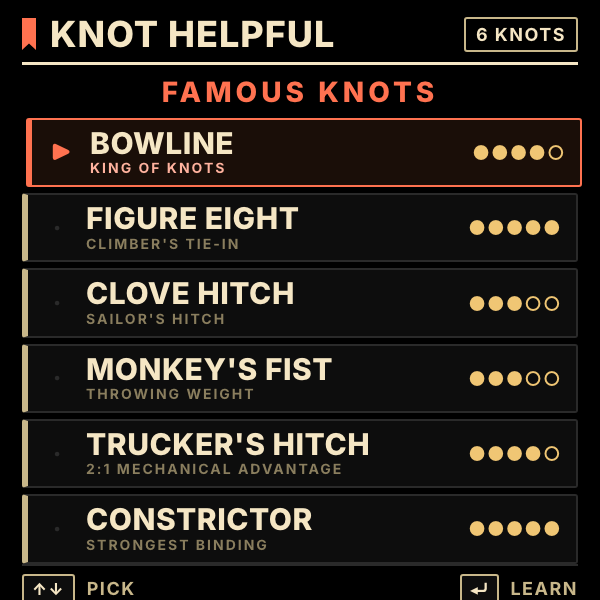 |

### Bowline (the rabbit story, four steps)

| 1. Rabbit hole | 2. Up through | 3. Around the tree | 4. Back down |
| --- | --- | --- | --- |
| 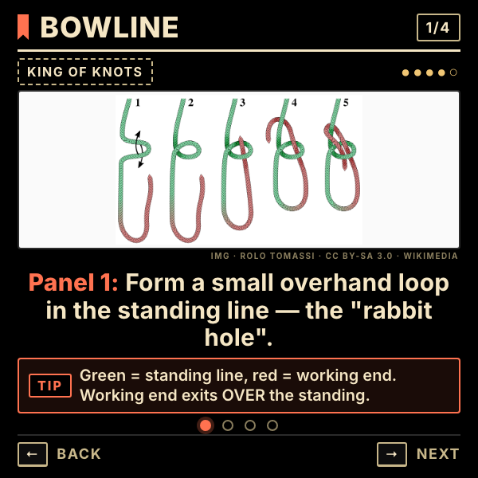 | 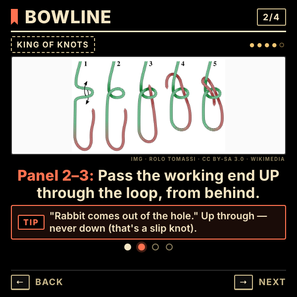 | 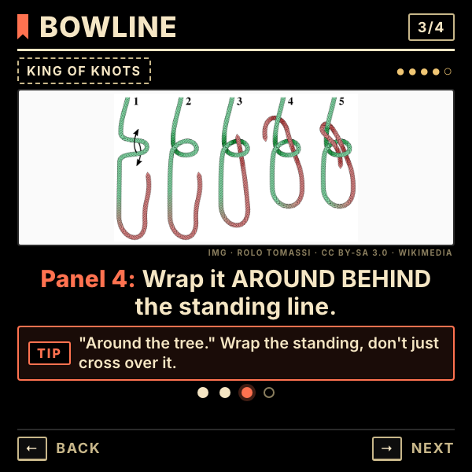 | 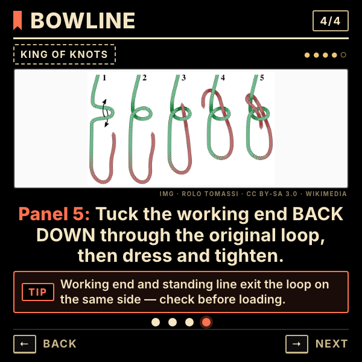 |

### Other knots (step 1)

| Figure Eight | Clove Hitch | Monkey's Fist |
| --- | --- | --- |
| 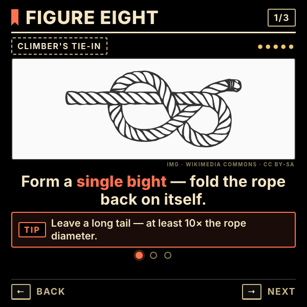 | 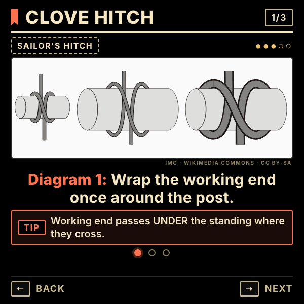 | 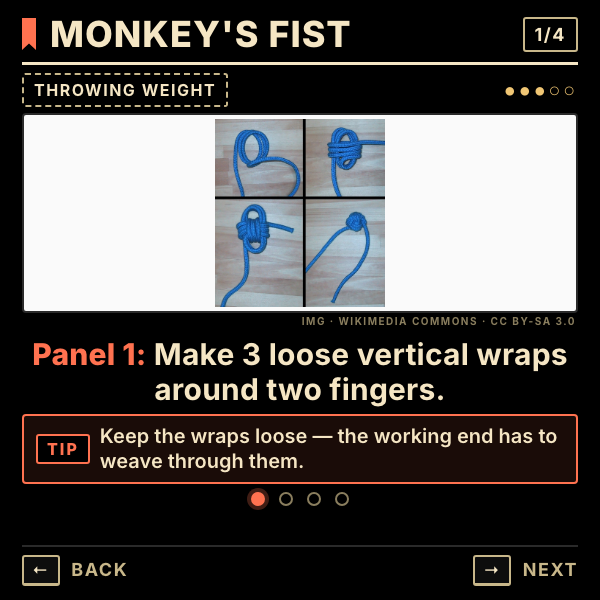 |

| Trucker's Hitch | Constrictor | Monkey's Fist (finished sphere) |
| --- | --- | --- |
| 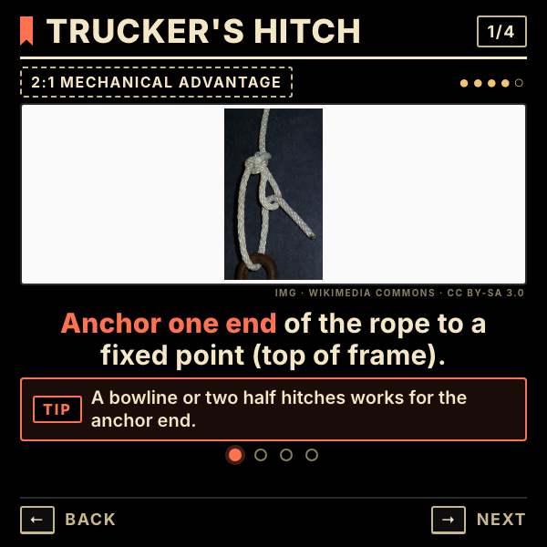 | 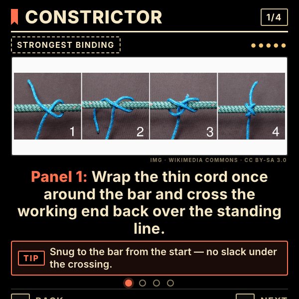 | 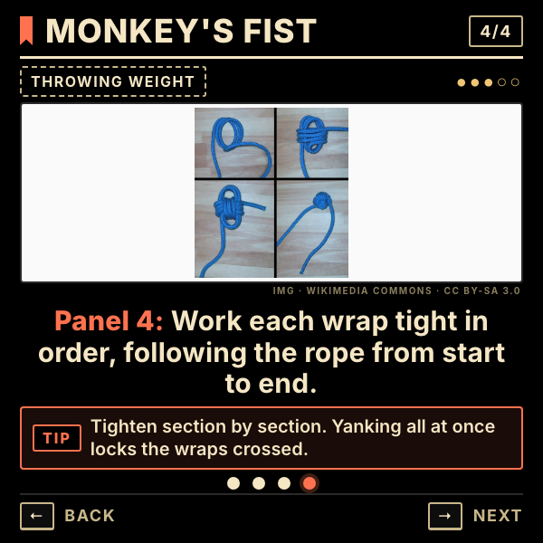 |

### Success card

| TIED WELL stamp on completion |
| --- |
| 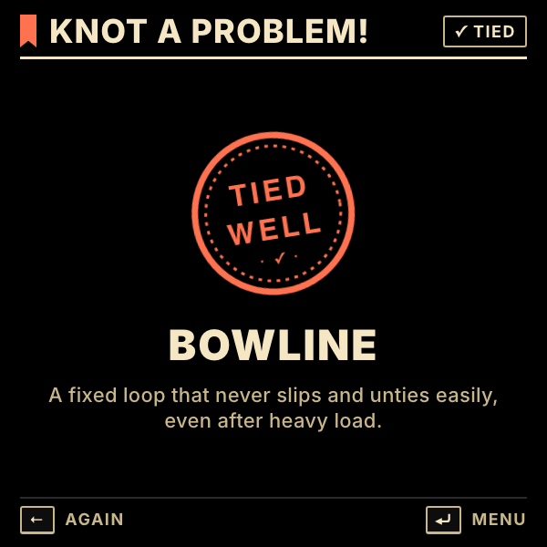 |

---

## Image credits

All knot diagrams are sourced from **Wikimedia Commons** and used under the license shown. Each is displayed with an on-screen credit line inside the app.

| Knot | Source file | Author | License |
| --- | --- | --- | --- |
| Bowline | [Bowline_tying.png](https://commons.wikimedia.org/wiki/File:Bowline_tying.png) | Rolo Tomassi | CC BY-SA 3.0 |
| Figure Eight | [Figure-eight_knot.svg](https://commons.wikimedia.org/wiki/File:Figure-eight_knot.svg) | Wikimedia contributors | CC BY-SA |
| Clove Hitch | [Webeleinenstek1.svg](https://commons.wikimedia.org/wiki/File:Webeleinenstek1.svg), [Webeleinenstek2.svg](https://commons.wikimedia.org/wiki/File:Webeleinenstek2.svg), [Webeleinenstek3.svg](https://commons.wikimedia.org/wiki/File:Webeleinenstek3.svg) | Wikimedia contributors | CC BY-SA |
| Monkey's Fist | [Monkey_Fist_HowTo.jpg](https://commons.wikimedia.org/wiki/File:Monkey_Fist_HowTo.jpg) | Wikimedia contributors | CC BY-SA 3.0 |
| Trucker's Hitch | [TruckersHitchUsingAlpineButterfly2.jpg](https://commons.wikimedia.org/wiki/File:TruckersHitchUsingAlpineButterfly2.jpg) | Wikimedia contributors | CC BY-SA 3.0 |
| Constrictor | [Constrictor-ABOK-1249.jpg](https://commons.wikimedia.org/wiki/File:Constrictor-ABOK-1249.jpg) | Wikimedia contributors | CC BY-SA 3.0 |

---

## Running locally

The app is a single static HTML/CSS/JS bundle, no build step.

```bash
npx serve -l 4223 knot-help
# then open http://localhost:4223
```

For development inside the `meta-display-glasses-webapps` workspace it's also wired into `.claude/launch.json` as the `knot-help` preview target on port **4223**.

### Regenerating screenshots

> 🛠️ **Developer tooling only.** The app itself has zero Chrome dependency, it's vanilla HTML/CSS/JS that runs in the Ray-Ban Meta Display's built-in browser. The block below is just the local recipe used on a Mac to refresh the PNGs in `screenshots/`.

The screenshots above are produced from headless Chrome against the `?state=…` URL parameter the app reads on load:

```bash
npx serve -l 4324 knot-help &
CHROME="/Applications/Google Chrome.app/Contents/MacOS/Google Chrome"
for STATE in menu bowline bowline-step-2 bowline-step-3 bowline-step-4 \
             figure8 clove monkey-fist monkey-fist-step-4 \
             truckers constrictor done; do
  "$CHROME" --headless --disable-gpu --hide-scrollbars \
    --window-size=600,600 --virtual-time-budget=6000 \
    --screenshot="knot-help/screenshots/$STATE.png" \
    "http://localhost:4324/?state=$STATE"
done
cp knot-help/screenshots/menu.png knot-help/screenshots/preview.png
```

The state grammar is `<knot>[-step-N]` or `<knot>-done`, plus the literal `menu` and `done`.

---

## Files

```
knot-help/
├── index.html      # menu / learn / done screens + TIED WELL stamp
├── styles.css      # 600×600 dark HUD; bold Inter sans-serif, ember accent
├── app.js          # state machine, six knot definitions, image router, ?state= router
├── favicon.png     # ember rope curl on black
├── images/         # Wikimedia Commons knot diagrams (see credits above)
└── screenshots/    # generated state captures used by this README
```

---

<sub>Made by Alex Levin at [L+R](https://www.levinriegner.com).</sub>
