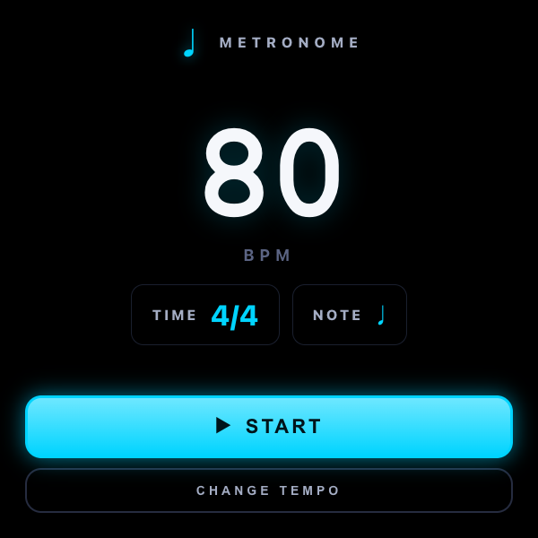
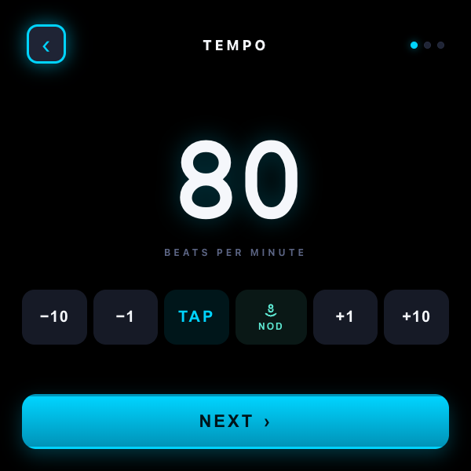
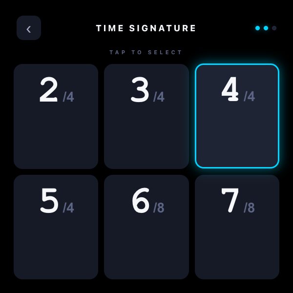
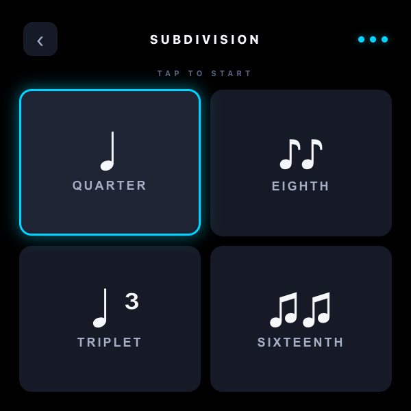
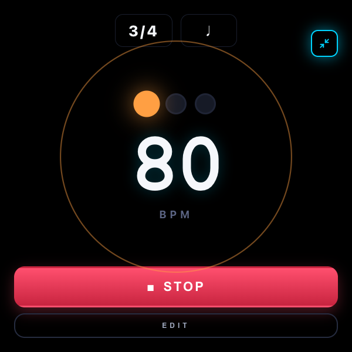
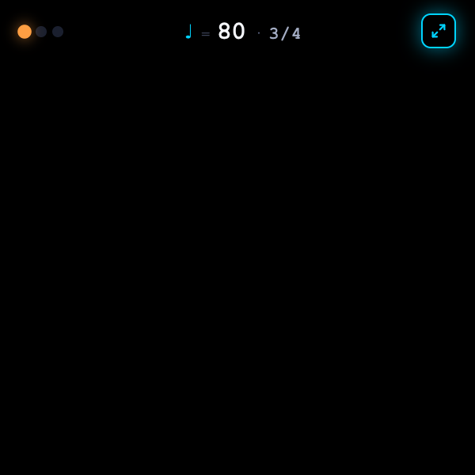

# Metronome

A focused, hands-free metronome built for the Ray-Ban Meta Display wearable. 600×600, single-screen at a time, big targets, AudioContext throughout. Set a tempo, a time signature, a subdivision — then collapse the UI down to a single 64px strip so the rest of your view stays unobstructed.

The original metronome crammed BPM, time signature, note value, volume, accent, and start/stop onto one screen. This rebuild splits the decisions into clear, large steps and lets the play screen disappear when you don't need it.

---

## The wizard

Three steps, each with one job and one large target. Big enough to read at glance distance, simple enough that the wrong button is hard to hit.

| Home | Tempo | Time signature | Subdivision |
| --- | --- | --- | --- |
|  |  |  |  |

**Home** shows the saved config as a card; **START** uses it as-is, **CHANGE TEMPO** drops into the wizard. On step 1 you set BPM via −10/−1/+1/+10, **TAP** (averages the last N taps), or **NOD** — a head-nod tempo picker that listens to `deviceorientation`, detects each full down-and-back nod cycle as one tap, and feeds it into the same averager. On steps 2 and 3, tapping a tile auto-advances; the active tile glows warm orange and the d-pad focus ring is cyan, so "selected" and "highlighted" never look the same.

## The play screen

Big mode shows everything (time sig + note tags, four beat dots, large flashing BPM, pulse ring, STOP, EDIT). Compact mode collapses the whole UI to a single 64px strip at the top of the display so the rest of your field of view stays clear — beat dots, ♩ = BPM, time signature, and an expand button. Pinching back to full mode is a tap on the expand icon or a swipe down anywhere on the screen.

| Full mode (3/4, quarter notes, beat 1 accented) | Compact HUD mode |
| --- | --- |
|  |  |

## Interactions

| Gesture / key | Effect |
| --- | --- |
| Tap **TAP** | Add a beat to the running tempo average |
| Tap **NOD** then nod your head | Each full nod cycle counts as one tap; tempo updates live |
| **←** / **→** on home or play | Nudge BPM by ±1 |
| Horizontal swipe on home or play | Same as ←/→ |
| Swipe down in compact mode | Expand to full mode |
| Swipe up / down on the BPM control row | Jump focus to BACK / NEXT |
| Tap **EDIT** while playing | Open the TEMPO step with **NOD** pre-focused |
| **Esc** | Stop playing, then back out a step at a time |

Every interaction also plays a short AudioContext-synthesised UI cue (`tick`, `focus`, `select`, `next`, `back`, `start`, `stop`) routed straight to `ctx.destination` so it doesn't ride the metronome volume gain.

## Audio engine

A scheduled lookahead loop synthesises each click as a 28ms damped sinusoid into an `AudioBuffer`: 1500 Hz on the accent, 1050 Hz on regular beats, 700 Hz on subdivisions. The first metronome tick is pushed out by 280ms after START so the louder `start` UI cue lands cleanly first; on STOP the master gain is ramped to silence over 20ms to mute any clicks the scheduler's 120ms lookahead has already queued.

## Files

```
metronome/
├── index.html
├── styles.css
├── app.js
├── favicon.svg
└── docs/screens/      ← README screenshots
```

No build step, no dependencies. Runs as static files. Local dev: `npx serve -l 4209 metronome`.

---

📖 Case study: [levinriegner.com/work/metronome](https://www.levinriegner.com/work/metronome/)

<sub>By Alex Levin · [L+R](https://www.levinriegner.com)</sub>
