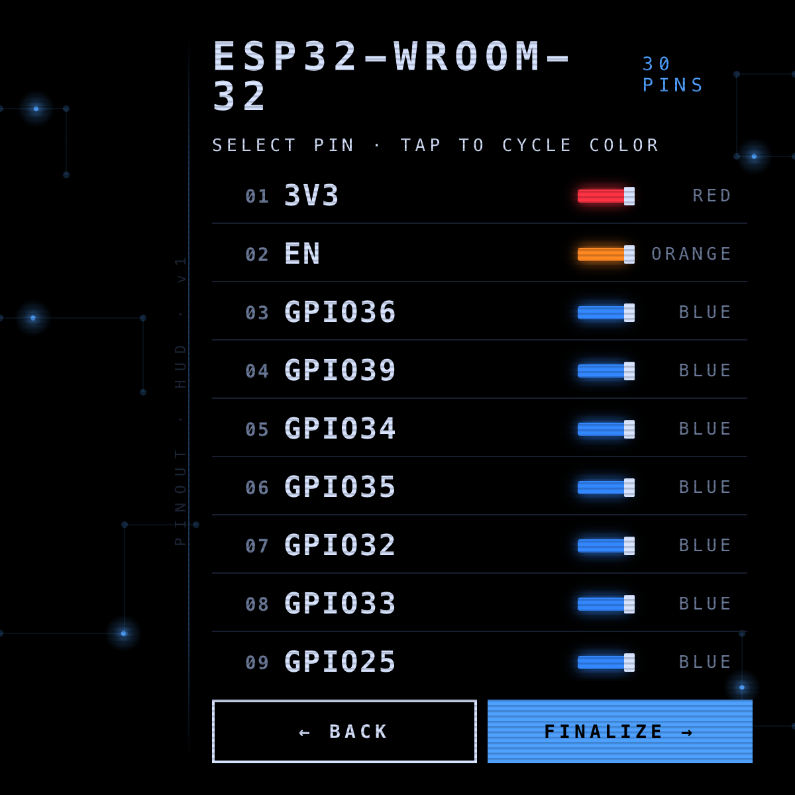
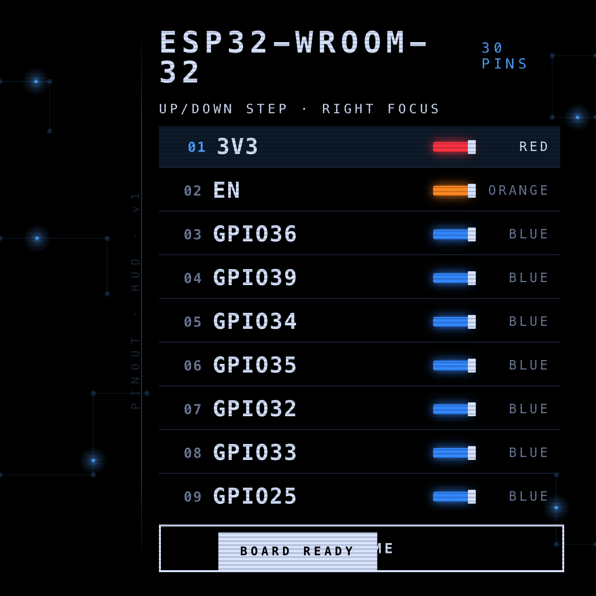
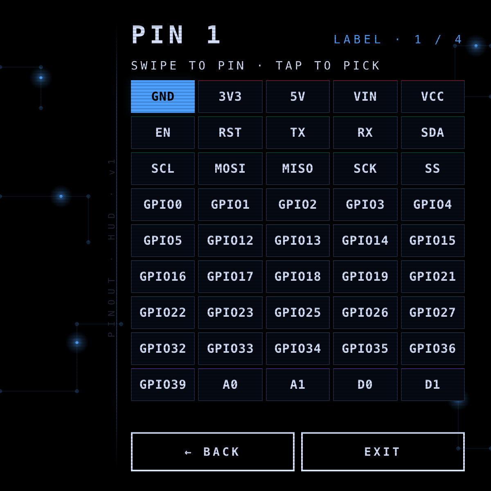
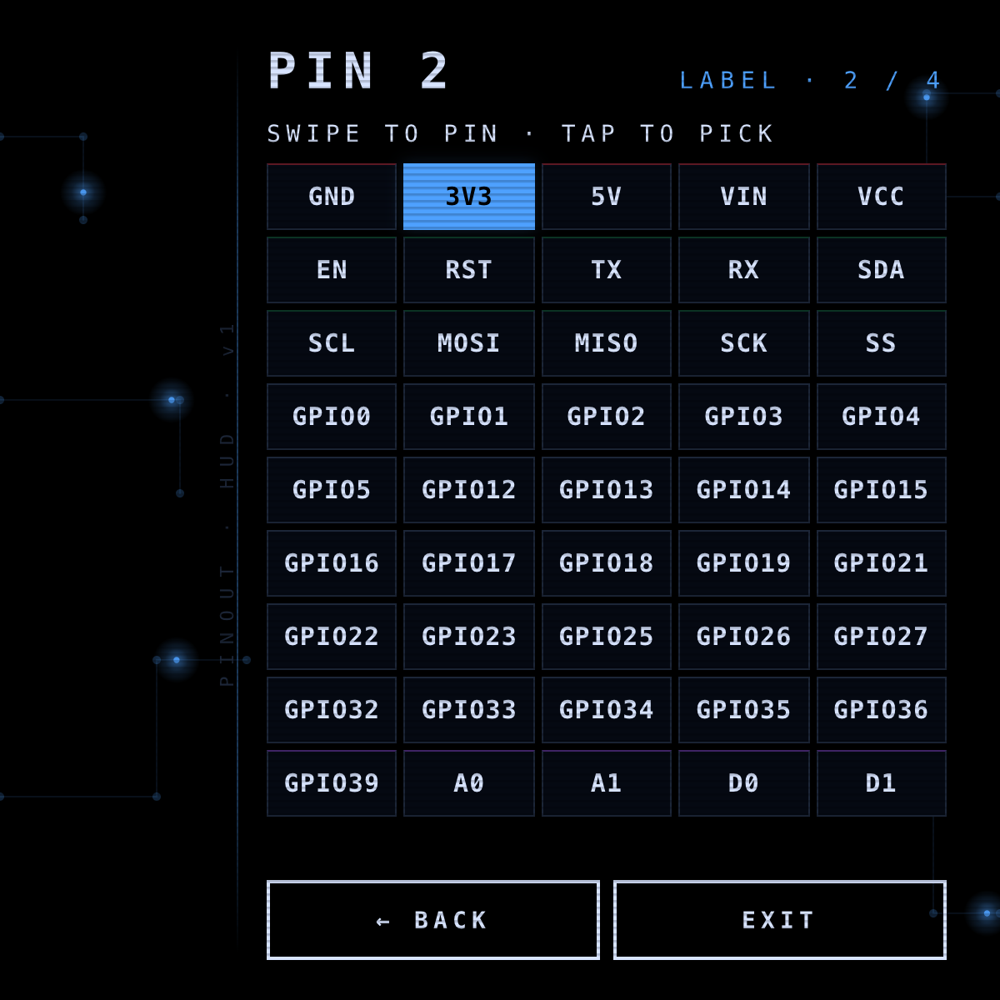
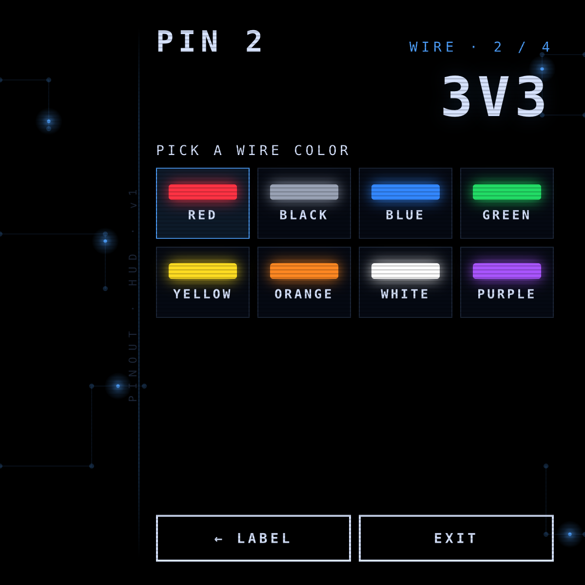
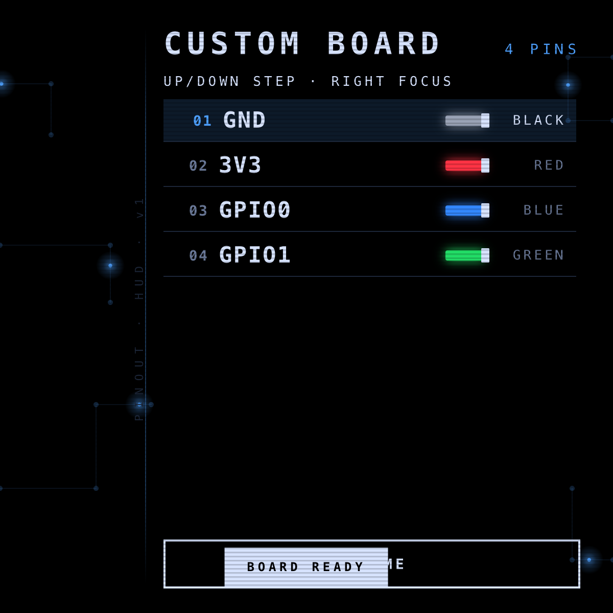

# Pinout HUD

A hands-free wiring diagram reference for the **Ray-Ban Meta Display** —
designed for electrical engineers actively soldering ESP32s and custom
microcontrollers. Glance at the schematic in your periphery instead of
putting the iron down to check a pinout.

<p align="center">
  
  
  
  
</p>

---

## Why

Soldering is two-handed work. The instant you reach for a phone or a
datasheet PDF, the joint cools, the iron drifts, and you lose your place
on the board. Pinout HUD lives in the right side of your lens — a
schematic-style HUD that keeps each pin's label and wire colour one
swipe away.

## How to use it

The Meta Display has no keyboard. The whole app drives off **four
directional swipes plus a tap** — the same gestures the temples expose.

| Gesture | What it does |
| --- | --- |
| Swipe Up / Down | Move focus through a list, step through pins |
| Swipe Left / Right | Move focus across a grid, or enter / exit Focus Mode |
| Tap | Select the focused item |

A browser preview maps **arrow keys** to swipes and **Enter / Space** to
tap so you can rehearse a flow at your desk.

---

## ESP32 templates

Four preloaded boards (WROOM-32, CAM, ESP8266 NodeMCU, S3-Mini). Pick
one, optionally tap any pin to cycle its wire colour, finalize, and
you're in the live reference HUD. Right-swipe enters Focus Mode — the
selected pin is rendered huge and everything else dims so you can never
solder the wrong pad by accident.

<p align="center">
  
  
  
  
</p>

---

## Custom boards

For one-off perfboards and unlabelled modules. The flow walks one pin at
a time — pick a label, pick a wire colour, advance.

The label step uses a **5 × 9 spatial grid** of the most common pin
labels (power · control · I²C · SPI · GPIO0–39 · analog / digital).
Swipe to land on any label in ≤4 moves, tap to confirm. Picking a label
auto-suggests its conventional wire colour (GND→black, 3V3→red, GPIO→blue,
TX→green, RX→yellow, SPI→purple / white) so the colour step is usually
just a confirmation tap.

<p align="center">
  
  
  
  
</p>

The next pin opens with **its** sensible default pre-focused — pin 2 is
3V3 in red. Two taps per pin gets you through the full build. When the
last pin is committed the app jumps straight into the live reference
HUD with a `BOARD READY` toast.

<p align="center">
  
  
</p>

---

## Focus Mode

The home HUD for the bench. Right-swipe from the overview to enter Focus
Mode; Up / Down step pins; Left-swipe exits.

<p align="center">
  
  
</p>

## Design notes

- **Schematic dark mode.** Pure black so the lens stays transparent,
  electric chrome accent (`#4ea1ff`), and eight high-contrast neon wire
  colours drawn with a glow + terminal end-cap.
- **Right-weighted.** `--pad-l: 160px` parks every screen against the
  right of the 600 × 600 lens; the left gutter is reserved for a
  vertical `PINOUT · HUD · v1` mark and a faint accent rule.
- **Canvas flourishes.** A background `<canvas>` paints five thin PCB
  polylines along the gutter and corners; a soft accent "current" pulse
  slides each trace on its own loop. Pure decoration; never overlaps
  active content.
- **Typography.** Monospace everywhere (SF Mono / JetBrains Mono) so
  `GPIO13` never gets misread as `GPIO18`.

## File layout

```
pinout-hud/
├── index.html        # 8 screens + toast + confirm
├── styles.css        # right-aligned HUD, neon wire palette
├── app.js            # state machine, focus mode, canvas init
├── data.js           # 4 ESP32 templates, label grid, default colours
└── screenshots/      # all images above
```

## Running locally

```bash
npx serve -l 4208 pinout-hud
```

Then open `http://localhost:4208` and use arrow keys + Enter to drive.

---

Case study: [levinriegner.com/work/pinout-hud](https://www.levinriegner.com/work/pinout-hud/)

<sub>By Alex Levin · [L+R](https://levinriegner.com)</sub>
