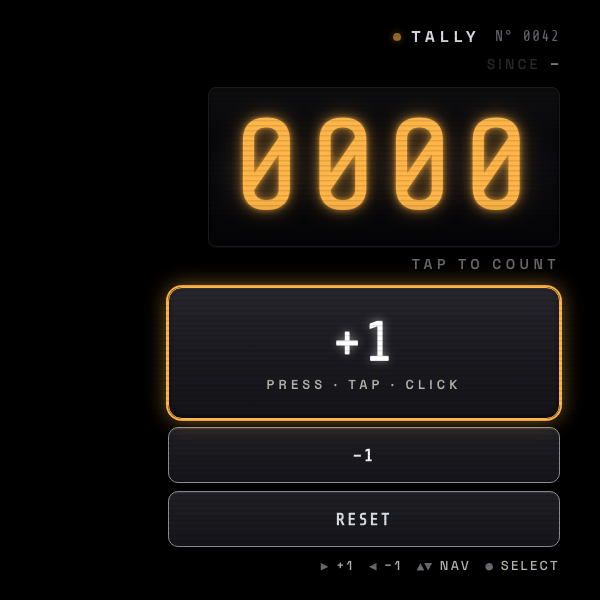
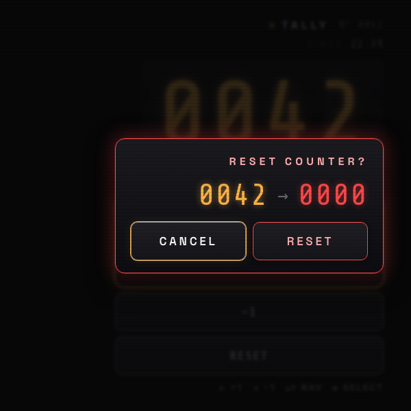

# Tally Counter

A wearable hand-tally-counter for the Ray-Ban Meta Display glasses. Press to count up. The big amber LED reads at a glance, the click confirms you didn't miss one, and the count survives reloads.

Inspired by mechanical knitting / coaching tally counters — the kind with a chrome button on top, four white drums in a black window, and a side knob for reset.

> 📖 **Case study:** [levinriegner.com/work/tally-counter](https://www.levinriegner.com/work/tally-counter/)

## Screenshots

<p align="center">
  
  &nbsp;
  
  &nbsp;
  
</p>

## Controls

| Input | Action |
| --- | --- |
| `▶` Right arrow | +1 |
| `◀` Left arrow | −1 |
| `▲▼` Up / Down | Move focus between **+1**, **−1**, **RESET** |
| `●` Enter / Space | Activate the focused button |
| Tap / click | Activate the tapped button |
| `R` | Open reset confirmation |
| `Esc` | Close reset confirmation |

The big **+1** button is the only thing you really need; the rest is for fixing miscounts and starting fresh.

## What it does

- **0000–9999** drum-roll readout, tabular-numeric amber on dark.
- **Light click** on every +1 (Web Audio API: short noise transient + tonal body, ~14 ms decay). A lower click on −1, a soft descending chime on reset.
- **Since HH:MM** timestamp captures the moment you started the current run; cleared on reset.
- **Persisted** in `localStorage` so the count survives a reload or app restart.
- **Reset is gated** by a confirmation overlay (cancel is the default focus, since reset is destructive).

## Running locally

```bash
npx serve -l 4211 tally-counter
```

Then open [http://localhost:4211](http://localhost:4211) — the viewport is locked to **600 × 600** to match the glasses display.

## Files

```
tally-counter/
├── index.html   # single-screen markup + reset-confirm overlay
├── styles.css   # right-aligned HUD, amber-LED display, chrome-rimmed buttons
└── app.js       # state, Web Audio click engine, keyboard nav, persistence
```

---

<sub>By <a href="https://www.levinriegner.com">Alex Levin · L+R</a></sub>
