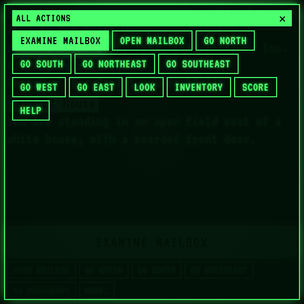

# zork-terminal

A wearable-sized tribute to early-1980s text adventures, built for the
600×600 HUD of the Ray-Ban Meta Display. Plain HTML / CSS / JS, no build
step, no dependencies.

| Boot screen | Gameplay | All-actions panel |
|:---:|:---:|:---:|
|  |  |  |

## What it is

A small, single-screen text-adventure UI that captures the feel of a
green-phosphor CRT and a paper-tape teletype, sized for a HUD that's
read at arm's length. The game world is a compact subset (~14 rooms,
three treasures, one nasty monster) so a full run fits in a glasses-
length sitting.

## Highlights

- **CRT terminal aesthetic** — green-on-black with scanlines, vignette,
  phosphor flicker, an inverted status bar at the top, and the iconic
  blocky monospace look (VT323 with system-monospace fallback).
- **Typewriter output** — every line types in at ~220 chars/sec, paced
  by real time via a `MessageChannel` loop so it stays smooth even when
  the tab is throttled. Tap anywhere mid-type to skip to the end.
- **Chip-based input** — no keyboard, no mic. A single big primary chip
  at the bottom plus a row (or two) of smaller secondary chips.
  - The **primary chip** is a *flavor* hint: "examine the most
    interesting unseen thing here". It never advances the puzzle — and
    it disappears entirely once you've examined what's around, so you
    can't tap-tap-tap your way through.
  - The **secondary chips** hold every actionable choice for this turn
    — open / take / move / read / attack / put / go &lt;dir&gt; — pulled
    from a tiered priority ranking. Primary and secondary come from the
    same de-duped list, so a chip never appears twice.
  - The **MORE…** chip opens a full-screen "All actions" panel with
    every contextually-valid command laid out in a grid; selecting a
    chip there closes the panel, runs the command, and returns focus
    to the main screen.
- **Filled-green = selected** — the focused chip is the one filled
  green, on every screen. Keyboard arrows and touch swipes navigate in
  2D using bounding-rect geometry, with row wrap-around: swipe right
  off the end of a row lands on the first chip of the next row, and
  vice versa.
- **Synthesized audio** — Web Audio `AudioContext` driving a tiny synth
  for typewriter ticks, chip taps, boot zap, point chimes, combat hits
  and misses, grue death sweep, and a victory arpeggio. No audio files.
- **Smart "next step" logic** — story-critical chips are ranked highest
  so the right action (open the mailbox, take the sword, attack the
  troll, deposit a treasure, etc.) is always near the front of the
  secondary row. The primary stays out of the way unless the player
  walks into something new.

## How to play

1. Tap **BEGIN** to enter the world.
2. Read the room description. The big bright chip (when it appears)
   tells you to look closer at something new — tapping it never moves
   the story forward, just describes.
3. Pick an action from the smaller chips below — or tap **MORE…** to
   see every contextually-valid verb at once.
4. Use arrow keys / temple-touchpad swipes to move between chips. The
   currently-focused chip is the one filled green.
5. Find the three treasures of the underground empire, return them to
   the trophy case in the living room, and don't get eaten by a grue.

## Running locally

```
npx serve -l 4203 zork-terminal
```

Then open `http://localhost:4203/`.

URL hash routes (handy for sharing or for re-shooting screenshots):

- `/` — instructions screen
- `/#gameplay` — auto-taps **BEGIN**
- `/#more` — auto-taps **BEGIN** then opens the **All actions** panel

## Files

- `index.html` — the CRT shell (status bar, output area, chip bar,
  MORE… panel).
- `styles.css` — green phosphor palette, scanlines/vignette/flicker,
  chip and focus styling.
- `world.js` — every room, item, and the initial game state.
- `app.js` — typewriter queue, parser, verbs, chip ranking + 2D
  navigation, Web Audio synth, URL-hash router.

## Case study

A longer write-up of how this was made, with motion and design notes,
lives at the L+R portfolio:

→ <https://www.levinriegner.com/work/zork-i-tribute/>

---

<sub>Built by Alex Levin · [L+R](https://levinriegner.com)</sub>
